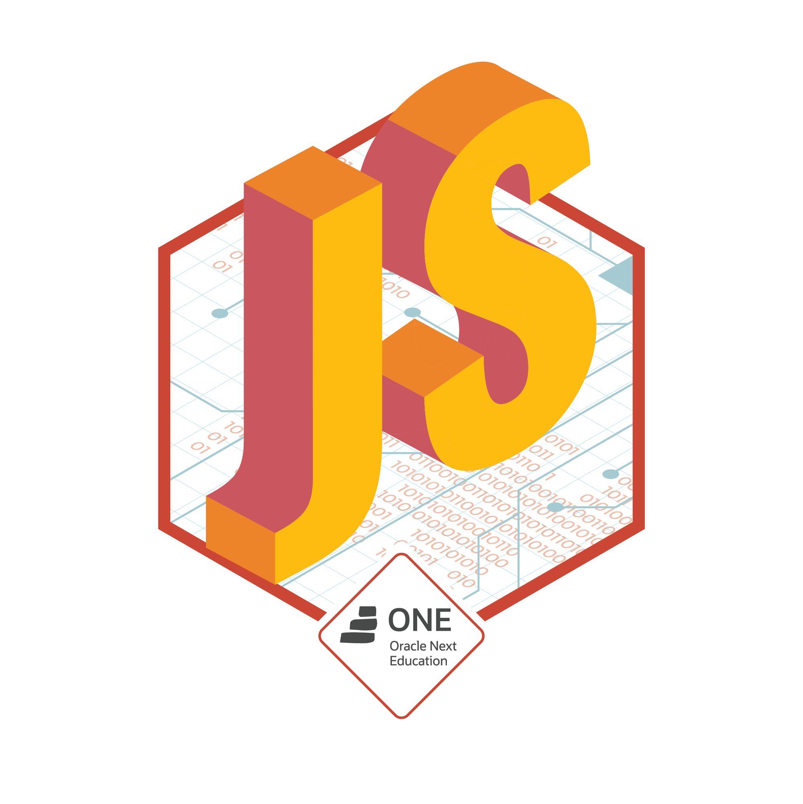

## Jogo da Forca
Projeto desenvolvido para o desafio da Challenge Oracle ONE na formação de linguagem Java, com o objetivo de aprender a linguagem, foi proposto fazer um conversor de moedas em Java.

  
  ##
  
### O projeto

É um Coversor de medidas que mede moedas e temperatura.

