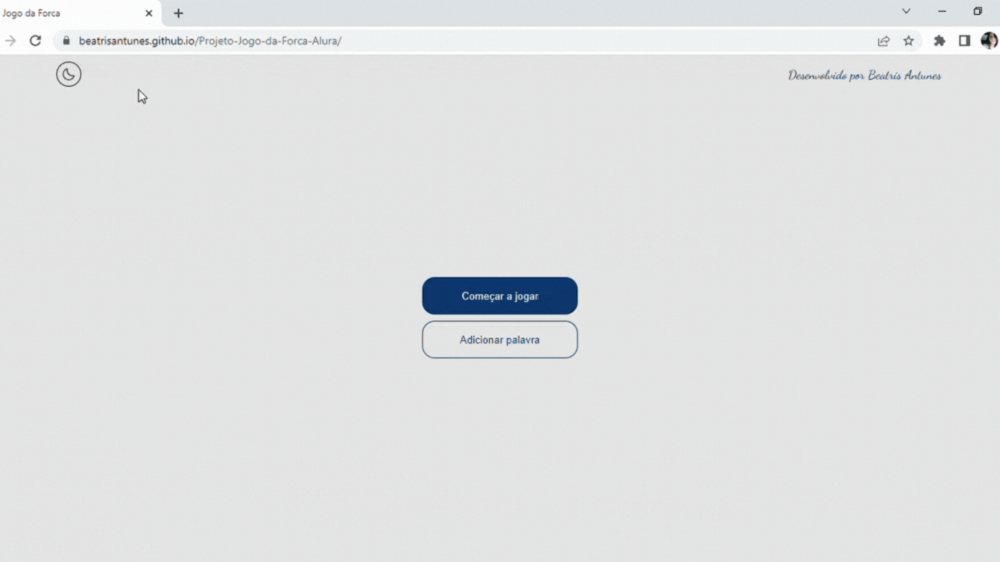

<h1 align="center">Jogo da Forca</h1>
Projeto desenvolvido para o desafio da Challenge Oracle ONE na formação de Iniciante em Programação, com o objetivo de aprender o básico da lógica de programação e JavaScript, foi proposto fazer um Jogo da Forca em Javascript.

  
> Trilha de Iniciante em Programação 
  
  É um jogo em que o jogador tem que acertar qual é a palavra proposta, tendo como dica o número de letras. A cada letra errada, é desenhado uma parte do corpo do enforcado.

  ## Resultado:

  
  ## 💻🛠 Tecnologias e Ferramentas: 
  - HTML
  - CSS
  - JavaScript
  - Git e Github

  ## Link:
[🔗 Site](https://beatrisantunes.github.io/Projeto-Jogo-da-Forca-Alura/)
